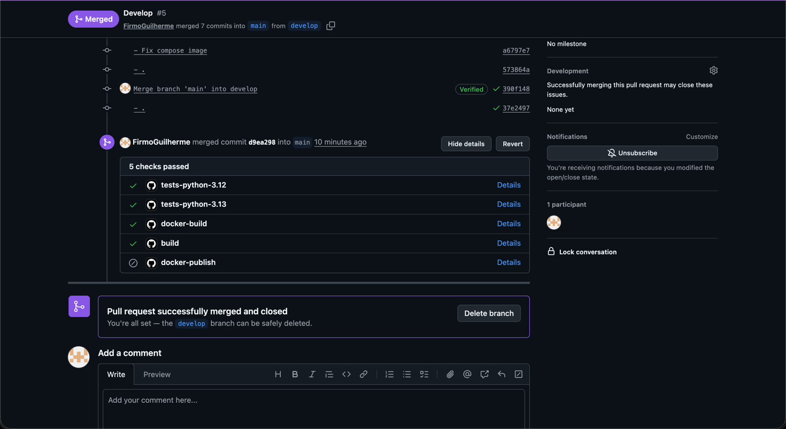

# Backend da Plataforma Adocao

Backend da plataforma Adocao, uma API para cadastro de abrigos, usuarios, pets e solicitacoes de adocao. O projeto foi desenvolvido em Python com FastAPI e segue uma organizacao em camadas inspirada em Clean Architecture.

## Integrantes

- Firmo Guilherme
- Guilherme Goehen
- Gustavo Arthur
- Gustavo Voss
- Leonardo Prado

## Stack

- Python 3.13
- FastAPI
- Pydantic
- SQLAlchemy
- PostgreSQL 16
- Docker e Docker Compose
- GitHub Actions
- unittest

## Como executar o projeto

### 1. Subir o ambiente com Docker

```bash
docker-compose up --build -d
```

### 2. Acessar a API

Com o container em execucao, a documentacao interativa da API fica disponivel em:

[http://localhost:8000/docs](http://localhost:8000/docs)

### 3. Executar os testes

Os testes automatizados usam `unittest`:

```bash
python -m unittest discover -s tests -v
```

### 4. Instalar dependencias localmente

Para rodar o projeto fora do Docker:

```bash
python -m pip install --upgrade pip
pip install -r requirements.txt
```

Depois, inicie a API com:

```bash
uvicorn app.main:app --reload
```

## Estrutura do projeto

- **app/core/:** configuracoes, banco de dados e utilitarios.
- **app/domain/:** entidades, enums e interfaces dos repositorios.
- **app/infrastructure/:** modelos SQLAlchemy e implementacoes dos repositorios.
- **app/application/:** casos de uso e servicos da aplicacao.
- **app/presentation/:** rotas e dependencias da API FastAPI.
- **tests/:** testes automatizados com `unittest`.
- **.github/workflows/:** pipeline de CI com GitHub Actions.

## CI/CD

O projeto possui um pipeline no GitHub Actions para instalar dependencias, executar testes, criar a imagem Docker, publicar o artefato do build e enviar a imagem final para o Docker Hub em pushes na branch `main`.

Para a publicacao no Docker Hub, configure estes secrets no GitHub:

- `DOCKERHUB_USERNAME`
- `DOCKERHUB_TOKEN`

As explicacoes detalhadas sobre pipeline, secrets, matriz de versoes, artefatos e protecao de Pull Request estao no arquivo [APRESENTACAO.md](APRESENTACAO.md).

O passo a passo de cada job e step do workflow esta no arquivo [EXPLICACAO_WORKFLOW.md](EXPLICACAO_WORKFLOW.md).

## Respostas das tarefas

### O que acontece se um teste falhar propositalmente?

Foi criado temporariamente um teste com `self.assertTrue(False)`. O resultado foi:

```text
FAILED (failures=1)
```

Quando isso acontece, o comando de testes retorna erro, a etapa de testes falha e o pipeline nao conclui com sucesso. Depois da validacao, o teste proposital foi removido.

### Em que cenario real a publicacao de artefatos seria util?

A publicacao de artefatos e util quando alguem precisa baixar exatamente o mesmo build gerado pelo pipeline. Por exemplo: validar em homologacao, entregar o pacote do trabalho, auditar uma versao ou usar o artefato em uma etapa posterior de deploy.

### Por que nunca devemos commitar credenciais no codigo?

Porque o historico do Git preserva essas informacoes mesmo depois de apagar o arquivo. Se uma senha, token ou chave vazar, outras pessoas podem acessar banco de dados, APIs ou servicos privados. Credenciais devem ficar em secrets, variaveis protegidas ou cofres de segredo.

### Qual versao apresentou alguma diferenca de comportamento?

Nao houve diferenca de comportamento observada entre Python 3.12 e Python 3.13.

### Pipeline de Pull Request com Status Check


### Por que paralelismo importa em pipelines de CI?

Porque reduz o tempo de espera. Jobs independentes, como testes e build Docker, podem rodar ao mesmo tempo, dando retorno mais rapido para o time e facilitando identificar qual parte falhou.

### Qual a diferenca entre uma tag latest e uma tag por SHA?

A tag `latest` aponta para a versao mais recente publicada da imagem. Ela e pratica para ambientes de teste ou uso rapido, mas pode mudar a cada novo deploy.

A tag por SHA usa o identificador do commit, por exemplo `${{ github.sha }}`. Ela aponta para uma versao exata e imutavel do codigo, sendo melhor para auditoria, rollback e producao.


## Imagem Docker
docker push firmo10/adocao-backend:tagname